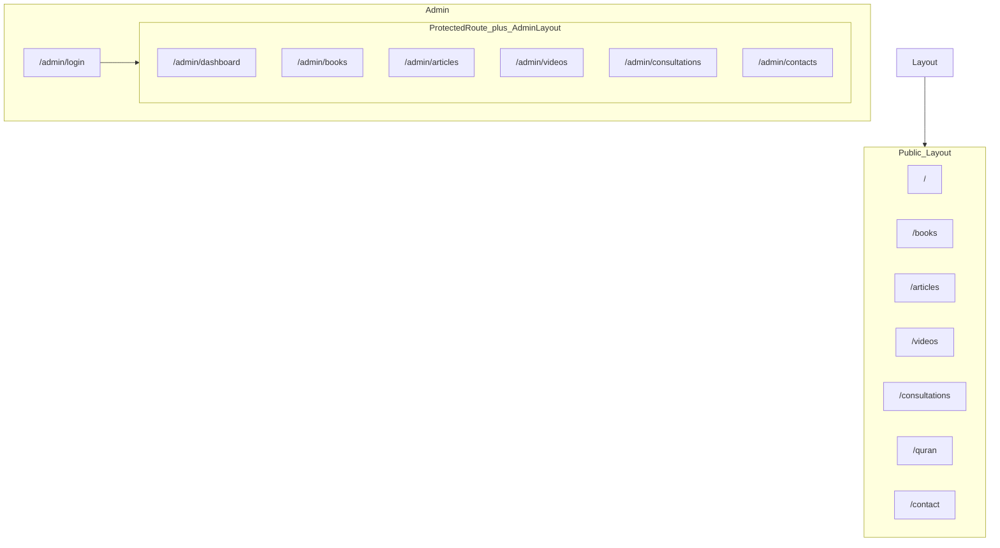

# خريطة هيكل مشروع eda2at

مرجع هيكل المستودع: الواجهة (Vite + React)، الخادم (Express)، قاعدة البيانات (PostgreSQL)، والمسارات.

## نظرة عامة

- **الواجهة**: React 19 + Vite 7 في جذر المشروع (`package.json`).
- **الخادم**: Express (CommonJS) في [`server/`](server/package.json).
- **قاعدة البيانات**: مخطط SQL في [`server/db/schema.sql`](server/db/schema.sql).
- **نشر/حاويات**: [`Dockerfile`](Dockerfile)، [`server/Dockerfile`](server/Dockerfile)، [`docker-compose.yml`](docker-compose.yml)، [`nginx.conf`](nginx.conf).

---

## شجرة المجلدات

```
eda2at/
├── index.html
├── vite.config.js
├── eslint.config.js
├── package.json
├── package-lock.json
├── Dockerfile
├── .dockerignore
├── docker-compose.yml
├── nginx.conf
├── init-neon-db.sh
├── README.md
├── .gitignore
├── STRUCTURE.md
├── src/                          # الواجهة (React)
│   ├── main.jsx
│   ├── App.jsx
│   ├── App.css
│   ├── index.css
│   ├── contexts/
│   │   └── AuthContext.jsx
│   ├── utils/
│   │   └── api.js
│   ├── components/
│   │   ├── Layout.jsx
│   │   ├── Layout.css
│   │   ├── Navbar.jsx
│   │   ├── Navbar.css
│   │   ├── Footer.jsx
│   │   ├── Footer.css
│   │   └── admin/
│   │       ├── ProtectedRoute.jsx
│   │       ├── AdminLayout.jsx
│   │       └── AdminLayout.css
│   └── pages/
│       ├── Home.jsx / Home.css
│       ├── Books.jsx / Books.css
│       ├── Articles.jsx / Articles.css
│       ├── Videos.jsx / Videos.css
│       ├── Consultations.jsx / Consultations.css
│       ├── QuranProject.jsx / QuranProject.css
│       ├── Contact.jsx / Contact.css
│       └── admin/
│           ├── AdminLogin.jsx / AdminLogin.css
│           ├── AdminDashboard.jsx / AdminDashboard.css
│           ├── ManageBooks.jsx / ManageBooks.css
│           ├── ManageArticles.jsx
│           ├── ManageVideos.jsx
│           ├── ViewConsultations.jsx
│           └── ViewContacts.jsx
└── server/
    ├── index.js
    ├── package.json
    ├── package-lock.json
    ├── Dockerfile
    ├── .dockerignore
    ├── config/
    │   └── db.js
    ├── middleware/
    │   └── auth.js
    ├── routes/
    │   ├── auth.js
    │   ├── books.js
    │   ├── articles.js
    │   ├── videos.js
    │   ├── consultations.js
    │   └── contact.js
    ├── db/
    │   └── schema.sql
    ├── update-admin-password.js
    └── test-hash.js
```

---

## مسارات الواجهة (React Router)

التعريف في [`src/App.jsx`](src/App.jsx).

| المسار | الصفحة | ملاحظات |
|--------|--------|---------|
| `/` | Home | داخل `Layout` (Navbar + Outlet + Footer) |
| `/books` | Books | عام |
| `/articles` | Articles | عام |
| `/videos` | Videos | عام |
| `/consultations` | Consultations | عام |
| `/quran` | QuranProject | عام |
| `/contact` | Contact | عام |
| `/admin/login` | AdminLogin | بدون `Layout` العام |
| `/admin/dashboard` | AdminDashboard | محمي + `AdminLayout` |
| `/admin/books` | ManageBooks | محمي |
| `/admin/articles` | ManageArticles | محمي |
| `/admin/videos` | ManageVideos | محمي |
| `/admin/consultations` | ViewConsultations | محمي |
| `/admin/contacts` | ViewContacts | محمي |

الغلاف العام: [`src/components/Layout.jsx`](src/components/Layout.jsx) (`Outlet` بين Navbar و Footer).

المصادقة: [`src/contexts/AuthContext.jsx`](src/contexts/AuthContext.jsx)؛ الحماية: [`src/components/admin/ProtectedRoute.jsx`](src/components/admin/ProtectedRoute.jsx).

### مخطط تدفق المسارات



---

## عميل HTTP للـ API

[`src/utils/api.js`](src/utils/api.js): Axios مع `baseURL` من `import.meta.env.VITE_API_URL` أو الافتراضي `http://localhost:5000/api`، وإرفاق `Authorization: Bearer <token>` من `localStorage`، وإعادة توجيه إلى `/admin/login` عند 401.

---

## واجهات الـ API (Express)

تسجيل المسارات في [`server/index.js`](server/index.js).

| البادئة | الملف |
|---------|--------|
| `/api/auth` | `server/routes/auth.js` |
| `/api/books` | `server/routes/books.js` |
| `/api/articles` | `server/routes/articles.js` |
| `/api/videos` | `server/routes/videos.js` |
| `/api/consultations` | `server/routes/consultations.js` |
| `/api/contact` | `server/routes/contact.js` |
| `/health` | مباشرة في `server/index.js` |

**ملاحظة**: المسارات التي تتطلب JWT تستخدم [`server/middleware/auth.js`](server/middleware/auth.js) (`authenticateToken`, `requireAdmin`).

### تفاصيل الـ endpoints

#### Auth (`/api/auth`)

| الطريقة | المسار | وصول | الوصف |
|---------|--------|------|--------|
| POST | `/api/auth/login` | عام | `{ username, password }` → `{ token, user }` |

#### Books (`/api/books`)

| الطريقة | المسار | وصول |
|---------|--------|------|
| GET | `/api/books` | عام |
| GET | `/api/books/:id` | عام |
| POST | `/api/books` | إداري |
| PUT | `/api/books/:id` | إداري |
| DELETE | `/api/books/:id` | إداري |

#### Articles (`/api/articles`)

| الطريقة | المسار | وصول |
|---------|--------|------|
| GET | `/api/articles` | عام |
| GET | `/api/articles/:id` | عام |
| POST | `/api/articles` | إداري |
| PUT | `/api/articles/:id` | إداري |
| DELETE | `/api/articles/:id` | إداري |

#### Videos (`/api/videos`)

| الطريقة | المسار | وصول |
|---------|--------|------|
| GET | `/api/videos` | عام |
| GET | `/api/videos/:id` | عام |
| POST | `/api/videos` | إداري |
| PUT | `/api/videos/:id` | إداري |
| DELETE | `/api/videos/:id` | إداري |

#### Consultations (`/api/consultations`)

| الطريقة | المسار | وصول | ملاحظات |
|---------|--------|------|-----------|
| GET | `/api/consultations` | إداري | قائمة الاستشارات |
| POST | `/api/consultations` | عام | إرسال استشارة (`type`: `family` \| `medical`) |
| PATCH | `/api/consultations/:id/status` | إداري | `status`: `pending` \| `reviewed` \| `replied` |
| DELETE | `/api/consultations/:id` | إداري | |

#### Contact (`/api/contact`)

| الطريقة | المسار | وصول | ملاحظات |
|---------|--------|------|-----------|
| GET | `/api/contact` | إداري | قائمة الرسائل |
| POST | `/api/contact` | عام | نموذج التواصل |
| PATCH | `/api/contact/:id/status` | إداري | `status`: `new` \| `read` \| `replied` |
| DELETE | `/api/contact/:id` | إداري | |

#### Health

| الطريقة | المسار | وصول |
|---------|--------|------|
| GET | `/health` | عام |

---

## قاعدة البيانات (PostgreSQL)

من [`server/db/schema.sql`](server/db/schema.sql):

| الجدول | الغرض |
|--------|--------|
| `users` | حسابات الإدارة |
| `books` | الكتب |
| `articles` | المقالات |
| `videos` | الفيديوهات (مع `youtube_id`) |
| `consultations` | طلبات الاستشارة |
| `contacts` | رسائل التواصل |

---

## تشغيل المشروع محلياً

**الواجهة** (من جذر المستودع، [`package.json`](package.json)):

- `npm run dev` — Vite
- `npm run build` / `npm run preview`
- `npm run lint`

**الخادم** ([`server/package.json`](server/package.json)):

- `npm run start` — `node index.js`
- `npm run dev` — `nodemon index.js`

تأكد من متغيرات البيئة للخادم وقاعدة البيانات (انظر `server/config/db.js` وملفات النشر في المستودع).
